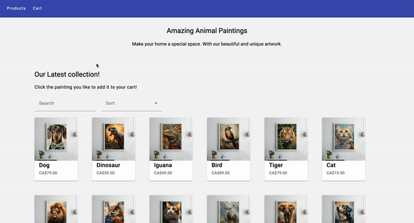

# E-Commerce Project

## Overview
This e-commerce project is an Angular-based web application designed to showcase products and manage user shopping carts. It features a rich, responsive UI built with Angular Material and includes functionalities like product listing, cart management, and checkout processes.


## Features
- **Product Listing:** Users can view a list of products, complete with descriptions, prices, and images.
- **Search and Sorting:** Products can be searched and sorted by price or other criteria.
- **Shopping Cart:** Users can add products to their cart, view the cart, modify item quantities, or remove items.
- **Checkout System:** A simple checkout process that simulates transaction completion.
Note: Since a mock backend API is used(Mockoon), related requests will be sent when related action is done(eg: checkout), but it will not be reflected in frontend page

## Technology Stack
- **Frontend:** Angular, Angular Material, CSS
- **Backend:** Mockoon for mocking backend services
- **Testing:** Jasmine and Karma for unit testing

## Getting Started

### Prerequisites
- Node.js
- npm (Node Package Manager)
- Angular CLI
- Git

### Installation

1. **Clone the repository:**
   ```bash
   git clone https://github.com/jingaovo/E-COMMERCE.git
   cd e-commerce
2. **Install dependencies:** `npm install`
3. **Run Mockoon environment**: 
Download the  Mockoon.json file and import to Mockoon
4. **Start the application**: 
Run `ng serve`, Navigate to http://localhost:4200/. The app will automatically reload if you change any of the source files.

### Running tests 
`ng test` to run tests through Karma

